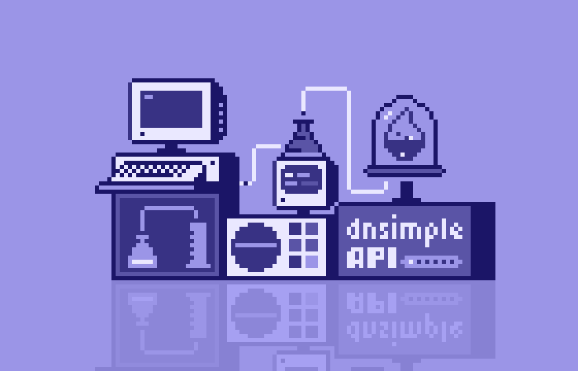

# ERPNext Developer
---

  

## About Me
Hello! I'm Mohammed Al-Qershi, an ERPNext developer with a strong background in building comprehensive business solutions. I specialize in ERPNext customization, development, and configuration, and have a proven track record of delivering high-quality projects.

## :rocket: Skills
- **ERPNext Framework:** Advanced proficiency in ERPNext customization, development, and configuration.
- **Python:** Extensive experience in Python programming language for ERPNext development.
- **Frappe Framework:** In-depth knowledge of Frappe framework for app development and customization.
- **Web Development:** Proficient in HTML, CSS, JavaScript, and React for frontend development within ERPNext.
- **Database:** Strong understanding of database concepts, with expertise in MySQL, MariaDB, or PostgreSQL.
- **Version Control:** Experienced in using Git for version control and collaboration.

## :briefcase: ERPNext Experience
- **Custom App Development:** Successfully developed and deployed custom ERPNext apps to meet specific business requirements.
- **DocTypes and Custom Fields:** Created and customized DocTypes and fields to enhance ERPNext functionality.
- **Workflows and Automation:** Designed and implemented complex workflows and automation scripts for streamlined business processes.
- **Reports and Dashboards:** Developed custom reports and dashboards for data analysis and visualization.
- **Integration:** Integrated ERPNext with external systems using APIs and webhooks, ensuring seamless data exchange.
- **Data Migration:** Proficient in data migration and import/export processes, ensuring smooth transition to ERPNext.
<!---
## :computer: Projects
### Project Name
- **Description:** 
- **Technologies Used:** ERPNext, Frappe, Python, HTML, CSS, JavaScript
- **GitHub Repository:** 

## :raised_hands: Contributions to ERPNext Community
- **Name of Open Source Project:** Description
-->
## :email: Contact
- **Email:** m.alqershi@altqniah.sa
- **LinkedIn:** [Mohammed Al-Qershi](https://www.linkedin.com/in/malqershi98/)
- **Phone:** +967772708867

Feel free to reach out to me if you have any inquiries or would like to discuss ERPNext development opportunities. I'm always enthusiastic about collaborating on new projects and contributing to the growth of the ERPNext community!

Thank you for visiting my profile.
<!---
- 👋 Hi, I’m @messam100
- 👀 I’m interested in ...
- 🌱 I’m currently learning ...
- 💞️ I’m looking to collaborate on ...
- 📫 How to reach me ...

messam100/messam100 is a ✨ special ✨ repository because its `README.md` (this file) appears on your GitHub profile.
You can click the Preview link to take a look at your changes.
--->
